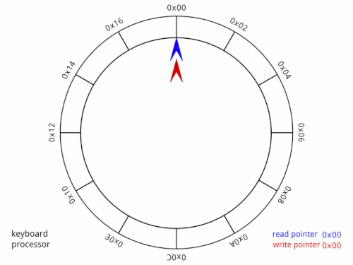

# Implementación de un Buffer Circular en C

## ¿Qué es un Buffer Circular?

Un **buffer circular** o *ring buffer* es una estructura de datos en forma de cola circular, útil para almacenar datos de manera temporal, como en la recepción UART. Su ventaja es el aprovechamiento eficiente de memoria sin necesidad de mover datos.



---

## Componentes Clave

* **Buffer:** memoria donde se guardan los datos.
* **Head:** índice de escritura.
* **Tail:** índice de lectura.
* **Capacity:** tamaño máximo del arreglo.

---

## Estructura y API en `ring_buffer.h`

```c
#ifndef RING_BUFFER_H
#define RING_BUFFER_H

#include <stdint.h>
#include <stdbool.h>

typedef struct {
    uint8_t *buffer;
    uint16_t head;
    uint16_t tail;
    uint16_t capacity;
} ring_buffer_t;

void ring_buffer_init(ring_buffer_t *rb, uint8_t *buffer, uint16_t capacity);
bool ring_buffer_write(ring_buffer_t *rb, uint8_t data);
bool ring_buffer_read(ring_buffer_t *rb, uint8_t *data);
uint16_t ring_buffer_count(ring_buffer_t *rb);
bool ring_buffer_is_empty(ring_buffer_t *rb);
bool ring_buffer_is_full(ring_buffer_t *rb);
void ring_buffer_flush(ring_buffer_t *rb);

#endif // RING_BUFFER_H

```

---

## Implementación en `ring_buffer.c`

```c
#include "ring_buffer.h"

void ring_buffer_init(ring_buffer_t *rb, uint8_t *buffer, uint16_t capacity) 
{

}

bool ring_buffer_write(ring_buffer_t *rb, uint8_t data)
{

    return true;
}

bool ring_buffer_read(ring_buffer_t *rb, uint8_t *data)
{

    return true;
}

uint16_t ring_buffer_count(ring_buffer_t *rb)
{

}

bool ring_buffer_is_empty(ring_buffer_t *rb)
{

}

bool ring_buffer_is_full(ring_buffer_t *rb)
{

}

void ring_buffer_flush(ring_buffer_t *rb)
{

}
```

---

## Ejemplo Conceptual de Uso

1. Agregue el archivo fuente al CMakeLists.txt

```CMake
# Add sources to executable
target_sources(${CMAKE_PROJECT_NAME} PRIVATE
    # Add user sources here
    Core/Src/led_driver.c
    Core/Src/ring_buffer.c
)
```

2. Agregue el codigo en los bloques indicados en `main.c`:

```c
/* USER CODE BEGIN Includes */
#include "ring_buffer.h"
/* USER CODE END Includes */

/* USER CODE BEGIN PV */
#define UART2_RX_LEN 16
uint8_t uart2_rx_buffer[UART2_RX_LEN];
ring_buffer_t uart2_rx_rb;
uint8_t uart2_rx_data; // Variable to hold received data
/* USER CODE END PV */

/* USER CODE BEGIN 0 */
void HAL_UART_RxCpltCallback(UART_HandleTypeDef *huart)
{
    if (huart->Instance == USART2) {
      HAL_UART_Receive_IT(&huart2, &uart2_rx_data, 1);
      ring_buffer_write(&uart2_rx_rb, uart2_rx_data);
    }
}
/* USER CODE END 0 */

  /* USER CODE BEGIN 2 */
  ring_buffer_init(&uart2_rx_rb, uart2_rx_buffer, UART2_RX_LEN);
  HAL_UART_Receive_IT(&huart2, &uart2_rx_data, 1);
  /* USER CODE END 2 */

  /* Infinite loop */
  /* USER CODE BEGIN WHILE */
  while (1) {
    if (ring_buffer_count(&uart2_rx_rb) >= 5) {
      // If there are at least 5 bytes in the ring buffer, read and process them
      for (int i = 0; i < 5; i++) {
        if (ring_buffer_read(&uart2_rx_rb, &uart2_rx_data)) {
          // Process the received data (for example, print it)
          HAL_UART_Transmit(&huart2, &uart2_rx_data, 1, HAL_MAX_DELAY);
        }
      }
    }
    /* USER CODE END WHILE */

    /* USER CODE BEGIN 3 */
  }
  /* USER CODE END 3 */

```

---

## Ejercicio

Implemente las funciones de ring_buffer.c y pruebe su funcionalidad usando la consola de PC con el USART2.

**Siguiente Paso:** [Implementación de una librería para el teclado (KEYPAD.md)](KEYPAD.md)
